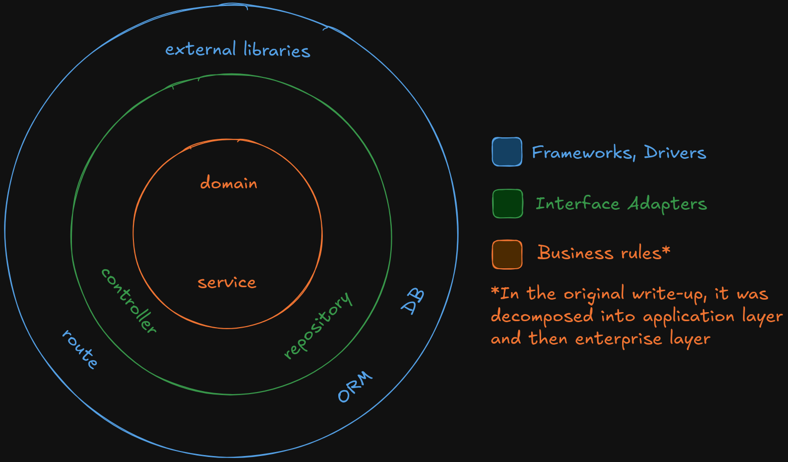
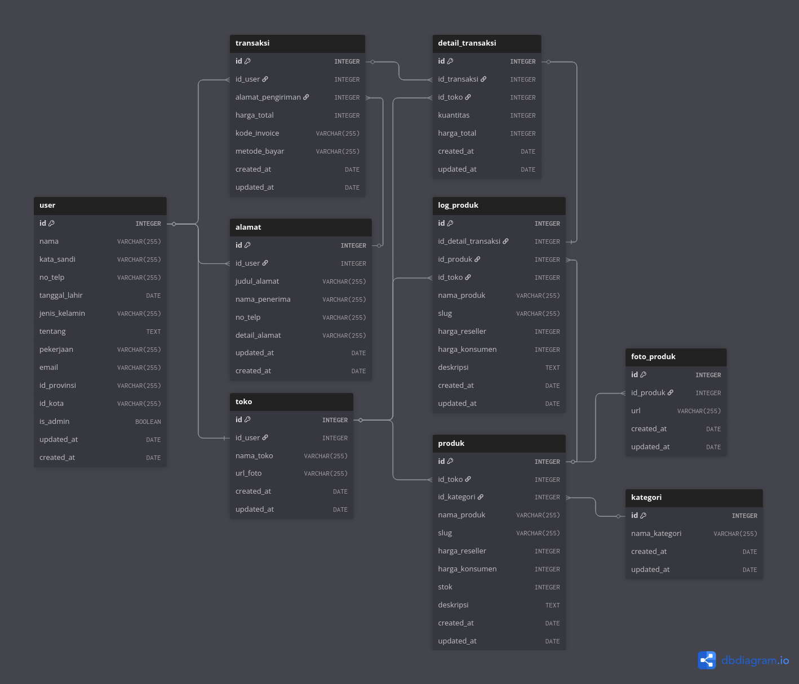

# goody 🛒
A CRUD API for supporting a product reselling platform

## Features

- [x] User account
- [x] Outlet management
- [x] Product management
- [x] Purchasing with customer or reseller price
- [x] Order item snapshots

## Tech Stack


## Documentation

### Endpoint Specification

The endpoints, its usage, and its potential responses provided by the system are available [here](https://7b9nbxdupb.apidog.io/)

### Architecture

The system architecture used is monolith. It was chosen because:

- It's simple to implement
- The user traffic pattern hasn't been discovered yet
- The API functionalities is still limited to simple CRUD

### Code Organization



The source code of this project took inspiration of Clean Code Architecture principles: 

- Code are separated into layers based on their responsibility
- Each of the layer's dependency can only points inwards

This principle enchances the flexibility of this project by allowing the developers to switch stack or libraries from one
to the other more easily as it's almost guaranteed that they won't need to modify the code for the inner layer. Here are 
the components composing each layers in this project with its mapping could be seen on the image above:

- **Route**, handles the routing
- **Controller**, processes the request and response
- **Service**, handles main application logic (usecase)
- **Repository**, provides DB interface for service
- **Domain**, handles business logic and constraints

### Data Schema



## Developing

This project is a capstone of a course I joined. I wanted to get a feeling of how does Go backend development ecosystem feels like. 
While there are no future updates planned, you could try to run the project yourself, if you want to extend or improve something.

1. Have Docker installed
2. On your favorite terminal, go to the root of this project and execute `docker compose up -d`
3. While the container runs smoothly, the database schema has yet been configured, so go to the container of the main app and run the migration:
   
   ```
   docker exec -it <name-of-app-container> sh

   # inside the container
   cd /path/to/sql/migration       # clue: the location is `/crud/migration/`
   /goose mysql $DB_URL up
   ```
   
4. It's done! You could try one or two requests, or jump directly executing your ideas
